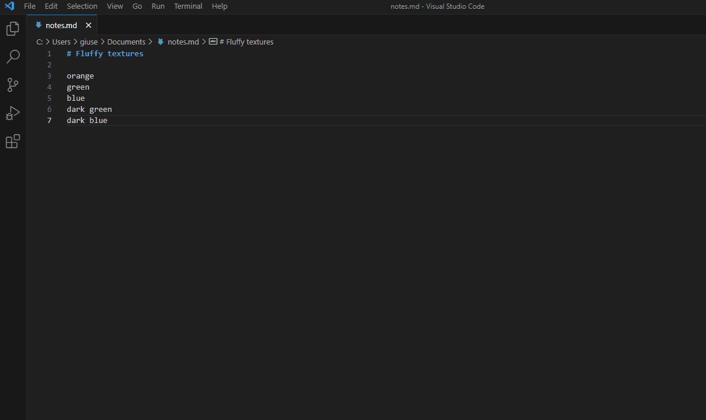

# Theta - transform text by template

This vscode extension transforms the current line, word, document, selected text or the clipboard using the Eta template engine. You can create your own set of tools to speed up repetitive coding tasks and text manipulation using just a little JavaScript.

## Quick Start and Basic Usage

- Create the directory that is going to contain your *.eta templates.
- In settings.json, set `theta.templatesPath` to the path of your directory (if you skip this step the extension will lead you to the user settings the first time you try to use it)
- Learn the [basic syntax of Eta templates](https://eta.js.org/docs/intro/template-syntax) and the most important parts of the [interface with Theta](docs/classes/TemplateProgrammingInterface.md) (namely [text](docs/classes/TemplateProgrammingInterface.md#text) and [rows](docs/classes/TemplateProgrammingInterface.md#rows)), that will be accessible via the variable `it` inside the template
- Write your first template for Theta. Here's a minimal example, save it as "Pascal Case.eta" in the templates directory:

```js
<%/***Theta {"defaultSelection": "word"} ***/%>
<%= it.text.trim().split(/[\s_]+/).map((word) => word[0].toUpperCase() + word.substring(1)).join('')  %>
```

- To use the template, select the text, press Ctrl+Shift+P and choose one of the Theta commands: 


## Commands

- Theta: Transform Selection and Copy (theta.copyAndTransform)
- Theta: Transform Clipboard and Paste (theta.transformAndPaste)
- Theta: Transform Selection (theta.transformSelection)

All the commands accept a template as optional argument, this allows you to create a shortcut to send text to your Theta template, for instance, if you add this to your keybindings.json:

```json
{
    "key": "Ctrl+Shift+T P",
    "command": "theta.transformSelection",
    "args": "Pascal Case"
},
```
The "Pascal Case.eta" template will be used to transform the selected text when you press the key combination.

## Settings

- `theta.templatesPath`: Specifies the folder path containing the *.eta template files.
- `theta.defaultSelection`: Define portion of the text used as input by transform commands when selection is empty. It can be overridden by template configuration. Possible values:
    - `none`: When selection is empty do nothing.
    - `word`: Current word.
    - `line`: Current line (default).
    - `document`: Whole document.
- `theta.formatOnPaste`: Overrides editor.formatOnPaste (ignored for snippets). It can be overridden by template configuration (default: `false`).

## Template-specific configuration

You can use a "front matter" in yaml format wrapped between `<%/***theta` and `*/%>` (extra asterisks can be used) in order to specify one or more settings, for instance:

```js
<%/***theta
defaultSelection: document
formatOnPaste: true
autoTrim: [false, 'nl']
***/%>
```

### Options used by Theta

These options are ignored when used in included files

- `isSnippet`: A boolean that specifies whether the output is a vscode snippet (default: `false`). If it's `true`, [the syntax of the body of snippets](https://code.visualstudio.com/docs/editor/userdefinedsnippets#_snippet-syntax) must be used. Placeholders and variables won't be replaced when the destination is the clipboard, so it's not meant to be used with "Transform Selection and Copy".
- `defaultSelection`: Like in [settings](#Settings), overrides its value if specified.
- `formatOnPaste`: Like in [settings](#Settings), overrides its value if specified.

### Options used by eta

These options are the file-specific versions of the homonymous eta options, they are not extended to included files (see partials in [Code reuse](#code-reuse)) but they can be used again in each of them.

- `autoTrim`: Controls new line/whitespace trimming like [autoTrim](https://eta.js.org/docs/2.x.x/api/configuration#autotrim), valid values are `"nl"`, `"slurp"` and `false` or an array of 2 of them to specify different behavior before opening tags and after closing tags. The default value for Theta is `false`.
- `autoEscape`: Controls whether interpolations are automatically XML-escaped. The default value for Theta is `false`, it can be useful to change it when the output format is html or xml (in that case you can still by-pass it using raw interpolation tags `<%~ ~%>`).

## Code reuse

You have different ways to share code among templates.

### Partials

See [Partials](https://eta.js.org/docs/intro/template-syntax#partials-and-layouts) feature from Eta. For example, let's create the file `./include/to-pascal-case.eta` inside the Theta template directory with this content:

```js
<%= it.str.trim().split(/[\s_]+/).map((word) => word[0].toUpperCase() + word.substring(1)).join('') %>
```

Then we can use it in templates like this: 

```js
<%~ include("./include/to-pascal-case.eta", { str: it.text }) %>
```

This is just a minimal example that shows how to pass data to the partial (in this case the whole input), however a more useful application of this would involve a mix of raw content and evaluation tags.

### Dynamic import

A second way to reuse code is by dynamic import. E.g., let's add the file `./include/utils.mjs` containing:

```js
export function toPascalCase(str) {
    str = str.trim()
    if (str.length === 0) return str
    return str.split(/[\s_]+/).map((word) => word[0].toUpperCase() + word.substring(1)).join('')
}

export function camelCaseToSnakeCase(str) {
    return str.replace(/([a-zA-Z])(?=[A-Z])/g, '$1_').toLowerCase()
}
```

We can use this module in a template like this:

```js
<% let utils = await import (resolvePath("./include/utils.mjs")) %>
```

`resolvePath` converts paths relative to the template location to absolute paths. It's provided by Theta (it wouldn't work in other eta templates).

A problem with dynamic imports is that the module are cached, and Node.js doesn't re-load them the second time you process the template, even if you have changed it. A workaround that can be used when you are debugging the module is to change the path every time:

```js
<% let utils = await import (`${resolvePath("./include/utils.mjs")}?t={Date.now()}`) %>
```

You can make leverage on side effects, although it's not a good practice.

### @importJs (experimental)

Last way to reuse code is experimental (hence it's subject to deprecation and API changes) and it works by injecting objects or functions using `@importJs`. 
You could create a file `./include/to-pascal-case.js` containing only a function to achieve something similar to the example that uses partials. However you may find convenient to group functions as methods of an object. E.g., let's add the file `./include/string-utils.js` containing:

```js
Object({
    toPascalCase: function(str) {
        return str.trim().split(/[\s_]+/).map((word) => word[0].toUpperCase() + word.substring(1)).join('')
    },
    camelCaseToSnakeCase: function(str) {
        return str.replace(/([a-zA-Z])(?=[A-Z])/g,'$1_').toLowerCase()
    }
})
```

We can inject this object into a template like this:

```js
<%@importJs "./include/string-utils.js" as stringUtils %>
```

The effect of the import will be to inject code like this:

```js
let stringUtils = (function(){return /* content of the string-utils.js file*/})()
```

The `as` clause can be omitted (in this case the filename without extension is used as variable name).

Every considerations regarding side effects apply to this method as well, especially if you use the IIFE idiom (but in that case you should probably prefer dynamic import).

## Examples of code generation

- [cpp gMock.eta](examples/cpp%20gMock.eta) parses one or more c++ struct/class to generate mock classes, it shows a use of:
   - it.fail
   - it.source.relativePath
- [cpp enum.eta](examples/cpp%20enum.eta) parses lines to generate an enum class with a stream insertion operator, it shows how to:
   - combine Theta with vscode snippets
   - extract a title from a document path 



## Notes and known issues

 Although strictly speaking it's not a problem of Theta, you should pay a particular attention to changes to prototypes. Let's say that we want a modified version of the `forEach` method of `Array` that would help us to simplify the code when we need a separator between each iteration. A perfect place for this would be a module, that can be imported dynamically:

```js
Array.prototype.forEachSep = function(callback, separator, lastSeparator = "") {
    const lastIndex = this.length - 1
    for (let i = 0; i < this.length; ++i) {
        if (this.hasOwnProperty(i))
            callback(this[i], i, (i == lastIndex) ? lastSeparator : separator);
    }
}
```

Then we could use it like in this fragment of template that generates a TypeScript constructor:
```js
constructor(<% dependencies.forEachSep((d, i, separator) => { -%>
<%= lowercaseFirst(d.type) %><%=d.optional ? "?" : ""%>: <%= d.type %><%= separator%>
<%- }, ", ") %>) {
    //..
}
```

However, the prototype change will be persistent and global to all templates (and obviously it's much worse if you override a built-in method).

## TODO

- Create issues for possible improvements and features
  - bundle
  - support multiple template directories, with per-directory configuration
  - implement prototype pollution mitigation
