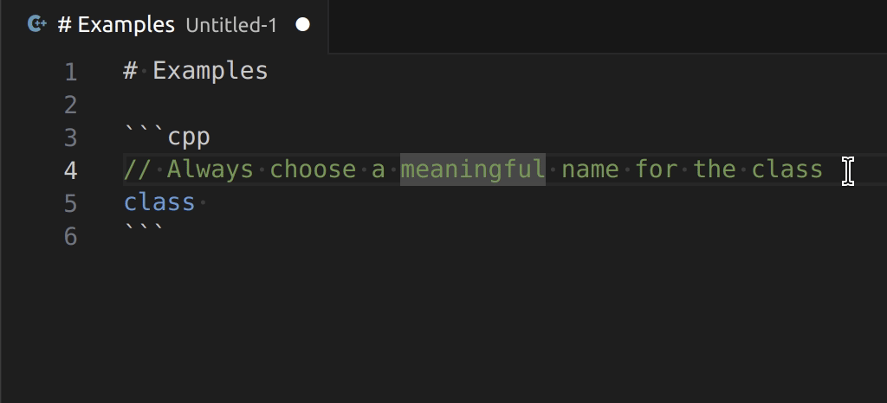

# Theta - transform text by template

This extension transforms the selected text or the clipboard using the Eta template engine.

## Quick Start and Basic Usage

- Create the directory that is going to contain your *.eta templates.
- In settings.json, set `theta.templatesPath` to the path of your directory (if you skip this step the extension will lead you to the user settings the first time you try to use it)
- Learn the [basic syntax of Eta templates](https://eta.js.org/docs/intro/template-syntax) and the most importat parts of the [interface with Theta](docs/classes/TemplateProgrammingInterface.md) (namely [text](docs/classes/TemplateProgrammingInterface.md#text) and [rows](docs/classes/TemplateProgrammingInterface.md#rows)), that will be accessible via the variable `it` inside the template
- Write your first template for Theta. Here's a minimal example, save it as "Pascal Case.eta" in the templates directory:

```js
<%@config({"defaultSelection": "word"}) %>
<%= it.text.split(/\s+/).map((word) => word[0].toUpperCase() + word.substring(1).toLowerCase()).join('')  %>
```

- To use the template, select the text, press Ctrl+Shift+P and choose one of the Theta commands: 



## Commands

- Theta: Transform Selection and Copy
- Theta: Transform Clipboard and Paste
- Theta: Transform Selection

All the commands accept a template as optional argument, this allows you to create a shortcut to send text to your theta template, for instance you could add this to your keybindings.json:

```json
{
    "key": "Ctrl+Shift+T P",
    "command": "theta.transformSelection",
    "args": "Pascal Case"
},
```

## Settings

- `theta.templatesPath`: Specifies the folder path containing the *.eta template files.
- `theta.defaultSelection`: Define portion of the text used as input by transform commands when selection is empty. It can be overridden by template configuration. Possible values:
    - `none`: When selection is empty do nothing.
    - `word`: Current wordline.
    - `line`: Current line (default).
    - `document`: Whole document.
- `theta.formatOnPaste`: Overrides editor.formatOnPaste (ignored for snippets). It can be overridden by template configuration (default: `false`).

## Template-specific configuration

You can use `<%@config(...) %>` as first line of the template specifing one or more settings in JSON format, for instance:

```js
<%@config({
    "defaultSelection": "document",
    "formatOnPaste": true
}) %>
```
Allowed members:

- `isSnippet`: A boolen that specifies wheteher the ouput is a vscode snippet (default: `false`). If it's `true`, [the syntax of the body of snippets](https://code.visualstudio.com/docs/editor/userdefinedsnippets#_snippet-syntax) must be used. Placeholders and variables won't be replaced when the destination is the clipboard, so it's not meant to be used with "Transform Selection and Copy"
- `defaultSelection`: Like in [settings](#Settings), overrides its value if specified.
- `formatOnPaste`: Like in [settings](#Settings), overrides its value if specified.


## Example of code generation

TODO

## TODO

- support multiple folders